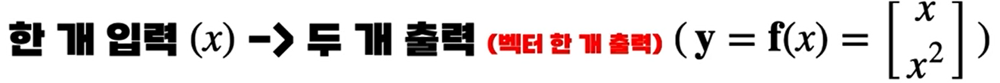

# 01. 함수와 다변수 함수
 학생 때, 배운 함수의 정의는 하나의 입력은 하나의 출력이 대응된다는 내용이 있다. 그런데, 딥러닝을 수학적으로 표현하는 과정에서, 하나의 입력에 여러 개의 출력이 나타나는 경우 존재한다. 이는 학생 때 배운 함수의 정의에 위배되는 것으로 보이나, 여러 개의 출력이 아닌 하나의 묶음이 출력되는 것으로 해석하면 된다. 즉, 여러 개의 출력이 하나로 묶인 함수가 출력되는 것이다. 이런 함수를 표현하는 방법은 이미지의 내용처럼 볼드체를 이용하고, 괄호를 통해 묶음을 표시한다.

원의 방정식이란 표현하고 원의 함수라고 표현하지 않는다.  그 이유는 함수는 하나의 입력은 하나의 출력이 대응되어야 하는데, 이를 만족하지 않기 때문이다.

# 02. 로그 함수

1. $ \log_{a^m} x = \frac{1}{m} * \log_{a} x $

2. $  \log_{a} b = \frac{\log_{c} b} {\log_{c} a} $

3. $ \log_{\exp} x = \ln x $

